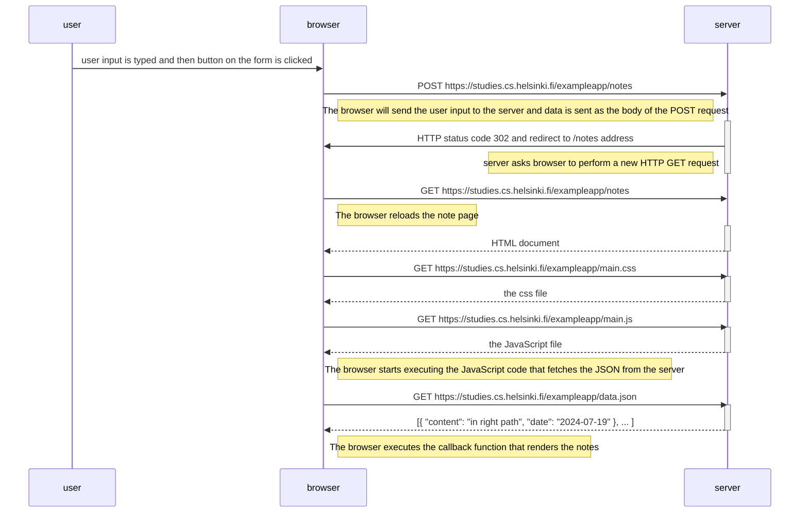

```mermaid
sequenceDiagram
    participant user;
    participant browser;
    participant server;

    user->>browser: user input is typed and then button on the form is clicked
    browser->>server: POST https://studies.cs.helsinki.fi/exampleapp/notes

    Note right of browser: The browser will send the user input to the server and data is sent as the body of the POST request

    activate server
    server->>browser: HTTP status code 302 and redirect to /notes address
    note left of server: server asks browser to perform a new HTTP GET request
    deactivate server


    browser->>server: GET https://studies.cs.helsinki.fi/exampleapp/notes
    Note right of browser: The browser reloads the note page
    activate server
    server-->>browser: HTML document
    deactivate server

    browser->>server: GET https://studies.cs.helsinki.fi/exampleapp/main.css
    activate server
    server-->>browser: the css file
    deactivate server

    browser->>server: GET https://studies.cs.helsinki.fi/exampleapp/main.js
    activate server
    server-->>browser: the JavaScript file
    deactivate server

    Note right of browser: The browser starts executing the JavaScript code that fetches the JSON from the server

    browser->>server: GET https://studies.cs.helsinki.fi/exampleapp/data.json
    activate server
    server-->>browser: [{ "content": "in right path", "date": "2024-07-19" }, ... ]
    deactivate server

    Note right of browser: The browser executes the callback function that renders the notes
```
