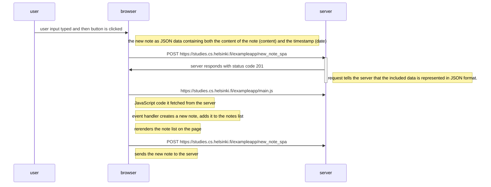

```mermaid
sequenceDiagram
    participant user;
    participant browser;
    participant server;

    user->>browser:user input typed and then button is clicked
    note right of browser:the new note as JSON data containing both the content of the note (content) and the timestamp (date)
    browser->>server: POST https://studies.cs.helsinki.fi/exampleapp/new_note_spa

    activate server
    server->>browser: server responds with status code 201
    note right of server:request tells the server that the included data is represented in JSON format.
    deactivate server

    browser->>server:https://studies.cs.helsinki.fi/exampleapp/main.js
    note right of browser: JavaScript code it fetched from the server

    note right of browser:event handler creates a new note, adds it to the notes list
    note right of browser:rerenders the note list on the page
    browser->>server: POST https://studies.cs.helsinki.fi/exampleapp/new_note_spa
    note right of browser:sends the new note to the server
```
